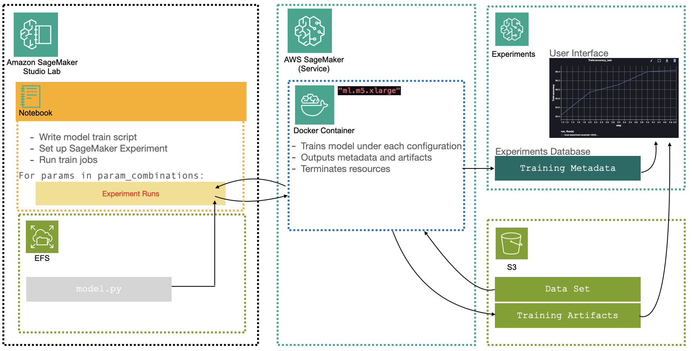
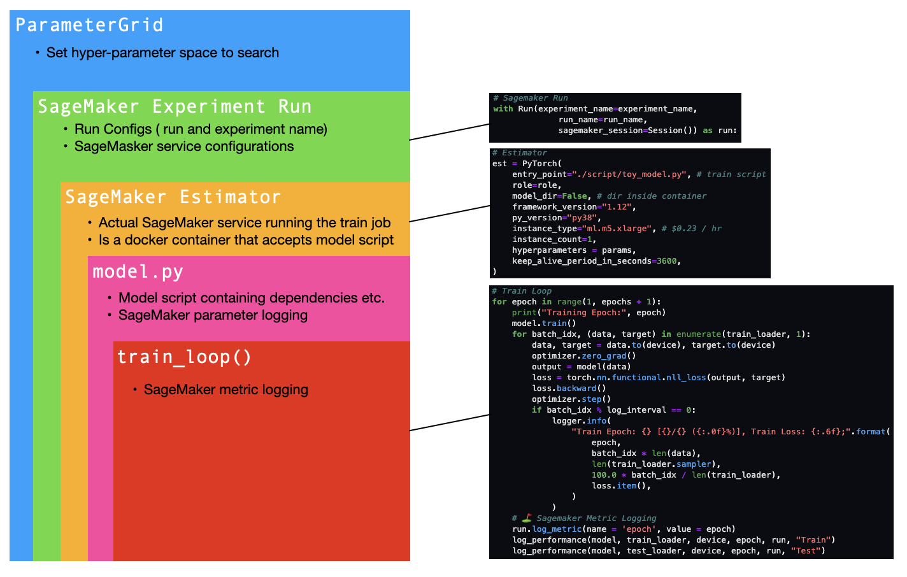
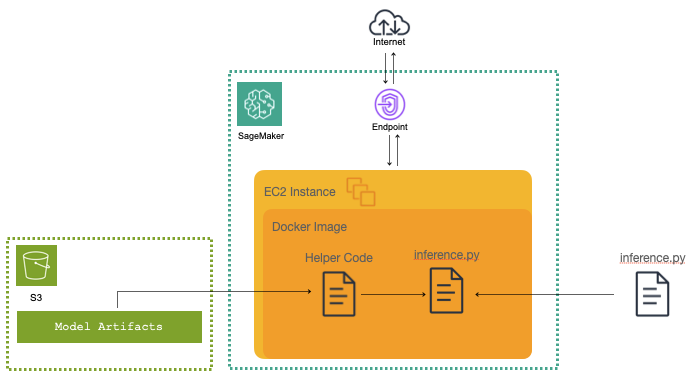

# SageMaker: Model Development to Deployment
A development / deployment workflow utilizing SM Training Jobs (in script mode), SM Experiments and SM Model Deployment. 

## Project Overview:
The purpose of this project was to create a workflow that easily transitions from initial prototyping of a model to a fully structured exploration of its hyperparameters and eventual deployment within the AWS SageMaker environment. Below is a diagram I've created that broadly outlines the AWS architecture involved in the experimentation process.

#### Topics Covered:
- Image dataset format manipulation & s3 storage
- Simple from-scratch image classification models and train loops
- Converting modles to training scripts and SageMaker Experiments
- Training / model artifacts management in AWS
- Deployment scripts and SageMaker model deployment endpoints & SDK

* Note: This project uses SageMaker Experiments v2.125
This workflow does not include some of the deployed model training features offered by AWS, nor does it involve SageMaker pipelines, though these would be logical extensions to the foundation provided here. 

Deployment is handled using the SageMaker SDK. A script it modified for a custom PyTorch model as well as the handling of image data for inference. Below is an oversimplified diagram of SageMaker Model deployment:

### Notebooks and Resources:
- Model Tracking w/ Train Jobs: https://sagemaker-examples.readthedocs.io/en/latest/sagemaker-experiments/sagemaker_job_tracking/pytorch_script_mode_training_job.html
- Model Tracking Locally: https://sagemaker-examples.readthedocs.io/en/latest/sagemaker-experiments/local_experiment_tracking/pytorch_experiment.html
- SM Experiments v2 Docs: https://sagemaker.readthedocs.io/en/v2.125.0/index.html
- SM PyTorch Model Deployment: https://sagemaker-examples.readthedocs.io/en/latest/frameworks/pytorch/get_started_mnist_deploy.html 